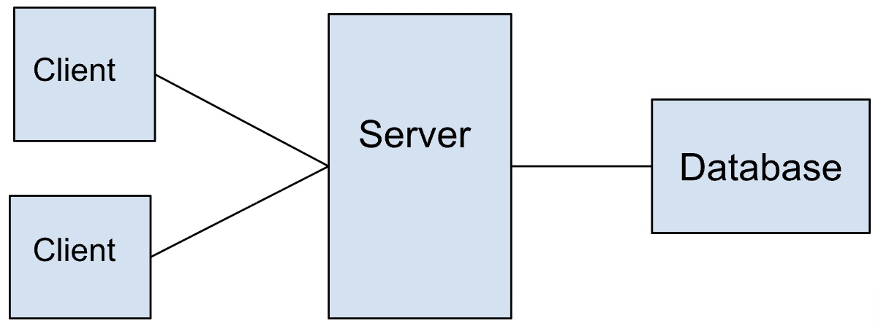

#  Interview Questions:

**Question 1:** Look up examples of cross site scripting attacks and SQL injections.

***Refleced XXS Attacks:***

Reflected attacks are those where the injected script is reflected off the web server, such as in an error message, search result, or any other response that includes some or all of the input sent to the server as part of the request. Reflected attacks are delivered to victims via another route, such as in an e-mail message, or on some other website. When a user is tricked into clicking on a malicious link, submitting a specially crafted form, or even just browsing to a malicious site, the injected code travels to the vulnerable web site, which reflects the attack back to the user’s browser. The browser then executes the code because it came from a “trusted” server. Reflected XSS is also sometimes referred to as Non-Persistent or Type-I XSS (the attack is carried out through a single request / response cycle).

***Stored XSS Attacks:***

Stored attacks are those where the injected script is permanently stored on the target servers, such as in a database, in a message forum, visitor log, comment field, etc. The victim then retrieves the malicious script from the server when it requests the stored information. Stored XSS is also sometimes referred to as Persistent or Type-II XSS.

***Blind Cross-site Scripting:***

Blind Cross-site Scripting is a form of persistent XSS. It generally occurs when the attacker’s payload saved on the server and reflected back to the victim from the backend application. For example in feedback forms, an attacker can submit the malicious payload using the form, and once the backend user/admin of the application will open the attacker’s submitted form via the backend application, the attacker’s payload will get executed. Blind Cross-site Scripting is hard to confirm in the real-world scenario but one of the best tools for this is XSS Hunter.

***Alternative XSS Syntax:***

XSS attacks may be conducted without using <script>...</script> tags. Other tags will do exactly the same thing, for example: <body onload=alert('test1')> or other attributes like: onmouseover, onerror.

onmouseover
<b onmouseover=alert('Wufff!')>click me!</b>

onerror


**Question 2:** How to prevent scripting attacks?

- Tools to Scan for XSS threats like Nessys and Nikto.

- You can prevent scripting attacks by sanitizing inputs and validating inputs

- Turn off HTTP TRACE support on all web servers. An attacker can steal cookie data via Javasript even whem document.cookie is disabled or not supported by the client. This attack is mounted when a user posts a malicious script to a forum so when another user clicks the link, an asynchornous HTTP Trace call is triggered which collects user's cookie information from the server, and then sends it over to another malicious server that collects the coolie information so the attacker can mount a session hijack. This is easily mitigated by removing support for HTTP Trace on all web servers. 


**Question 3:** What is parameter tampering?

Parameter tampering is a type of web application attack where an attacker mainpulates parameters exchaged between the client and server to gain unathorized access. modify data, or perform actions they shouldn't be allowed to.

It's a classic example of Broken Access Control or Insecure Design vulnerablity is OWASP terms.

***How It Works:***

When you interact with a web app, parameters are passed through:

- URLs (GET parameters)
- Forms (POST parameters)
- Cookies
- Headers
- hidden forms fields
- JSON/XML request bodies

An attacker intercepts and modifies these parameters - often using tools like Burp Suite, OWASP ZAP, or browser dev tools - before the request reachs the server.

***Examples:***

1. Price Manipulation:
http
```
POST /checkout
price=9.99&item_id=123
```

If the client controls the price field and the server doesn't revalidate it, an attack could change: 

http
```
price=0.01
```
leading to a massive underpayment.

2. Privilege Escalation:
http
```
GET /user/details?user_id=1001
```

If a logged-in user manually changes it to:

http
```
GET /user/details?user_id=1002
```

3. Bypassing Validation

If a form sends: 

http
```
isAdmin=false
```

An attacker could modify it to:

http
```
isAdmin=true
```

and gain admin privileges if the backend trusts the value. 

***How to Prevent Parameter Tampering:***

1. Never trust client input. Always validate and sanitize on the server side.

2. Use strong access control. Verify user permissions on every requst.

3. Implement integrity checks. Use HMACs or digital signatures on sensitive parameters. 

4. Avoid exposing sensitve info like role IDs or prices in the URLs or client visible code. 

5. Use secure framworks and middleware that handle session and authorization correctly. 

6. Perform penetration testing tools like Burp Suite or OWASP ZAP to detect tampering vulnerabilities. 


**Question 4:** What is the purpose of burp suite?

Burp suite is a professional security testin tool used for finding vulnerabilities i web appilications. Its main purpose is to help security researchers, ethical hackers, and developers analyze and secure web traffic between a browser (client) and a server. 

Here's a breakdown of its core purposes and how it's used:

1. Intecept and Inspect Web Traffic

Burp Suite acts as a man-in-the-middle proxy, allowing you to intercept, view, and modify HTTP(S) requests and responses between your browser and the target website.

This helps you":

- See what data is being sent or received.

- Identify hidden parameters or tokens.

- Test for input manipulation or injection vulnerabilities. 


2. Identify and Explit Vulenrabilites:

Burp Suite automates and assists with penetration testing by detecting issues like:

- SQL Injection
- Cross Site-Scriping (XSS)
- Broken Authentication
- Insecure Direct Object References (IDOR)
- Server-Side Request Forgery (SSRF)
- Cross Site Scripting Forgery (CSRF)

It is widely used for OWASP Top 10 vulnerabilitiy testing. 

3. Comprehensive Testing Tools

Burp Suite is a suite of tools including:

- Proxy - intercept and modifies traffic.
- Repeater - manually edit and resend individual requests.
- Intruder - automate customized attacks (like brute force of fuzzing).
- Scanner (Pro-Version) - automatically scans for common vulnerabilites
- Sequencer - analyzes randomness in session tokens.
- Comparer - compares requests/ responses to identify subtle changes.
- Decoder - encodes/ decodes data from formats like Base64, URL, or HTML.

5. Educational and Development Uses

Developers and Students often use Burp Suite to:

- Learn web security through controlled environments like (OWASP Juice Shop).
- Debug complex API calls and understand request/response cycles.
-Harden applications before deployment by running pre-launce penetration tests.


**Question 5:** Vulnerabilities of above design:



**Question 6:** Network vulnerabilities. What are examples of network attacks and vulnerabilities?


**Question 7:** Wireshark and tools for LLM injections.


**Question 8:** What to do if you get a really large cookie of human indistinguishable text? What tools can you use to figure out what the cookie is?

1. Identify the Format:

- Base64/JWT: Even if it look random, try base64-decoding. Many web frameworks base64-encode session data. If it's JWT you'll see JSON structure ({ "alg": ..., "typ": ... } in the header).

- Encrypted Seesion Token: Some frameworks (like Rails, Django, Sping) encrypt the whole session onject into the cookie. If so, you won't be able to read it without the server's key.

- Opaque Session ID: It might just be a long random string that's a pointer to session data on the server - this is actually the safest approach.

2. Security Checks You Should Perform:

- Check the cookie attributes:

    - Secure (only sent over HTTPS).

    - HTTPOnly (not accesible to Javascript).

    - SameSite (helps prevent CSRF).

- Size: Browser cookies have a 4 KB limit: If this one is far larger, it is a sign of bad design or possible leakage.

- Transport: Ensure it's being sent only over TLS.

3. Risks of Large Non-Readable Cookies

- Framework Session Storage: If it's storing session state clinet-side, it could bloat quickly and expose risks if encryption isn't solid. 

- Key Mismanagement: If weak cypto or predictable keys are used, attackers could forge session cookies.

- Hidden Data Leakage: Even though it looks random, it might hide sensitive info like user roles or PII.

4. As a Security Student, Next Steps:

- Try base64 decoding (sometimes multiple layers).

- It it's a JWT, inspect the claims and algorithm. 

- If it stays unreadable after decoding attempts, assume it was encrypted and focus on:

 - Whether the app reies too heavily on client-side state instead of server-side sessions. 
 
- Document the cookie size, attributes, and risks.

